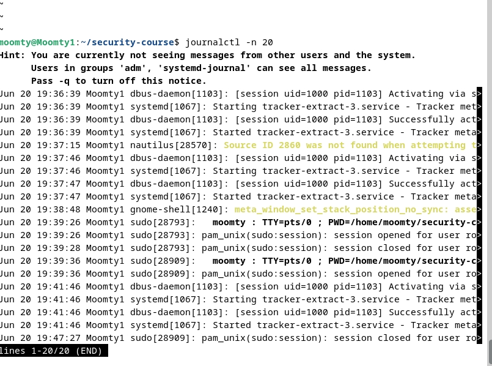
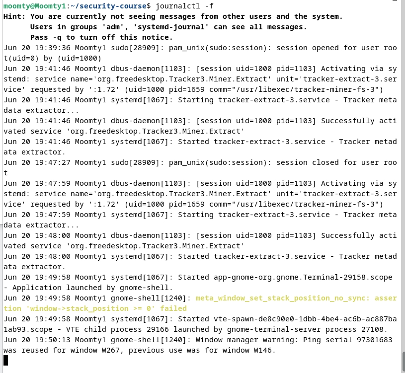
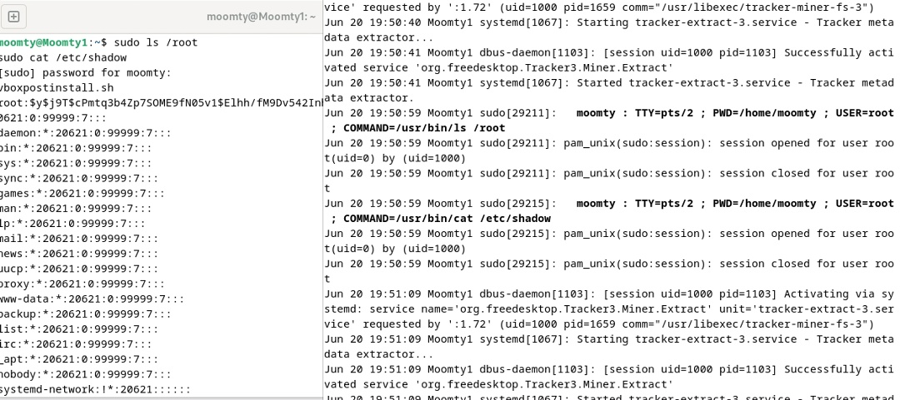
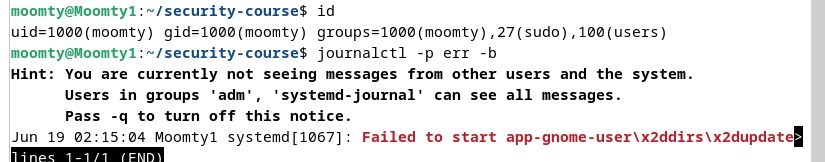
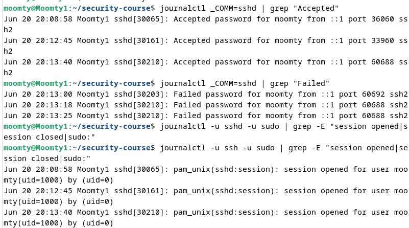
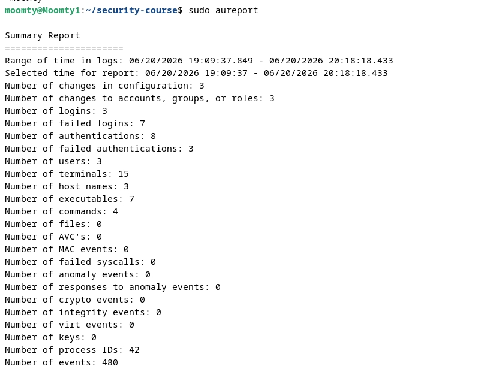
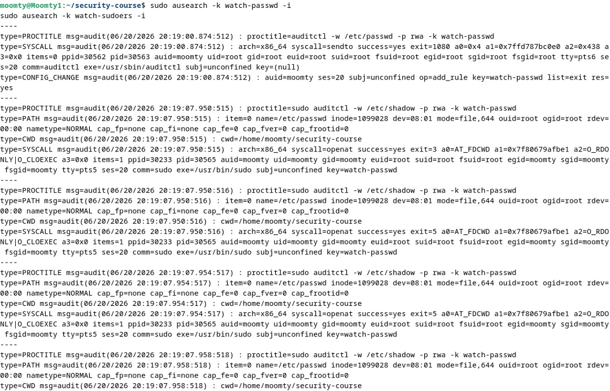
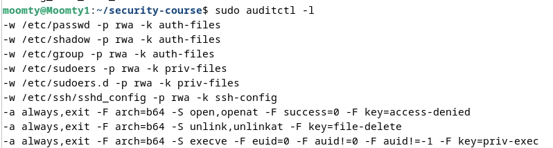
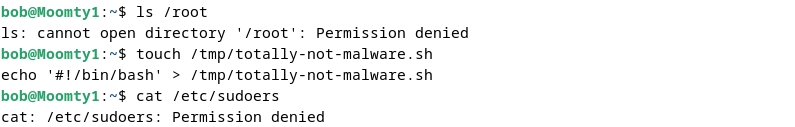

# ПР №4. Аудит событий: journalctl и auditd

## 1. journalctl — системный журнал

### 1.1 Просмотр последних 20 записей

### 1.2 Логи в режиме реального времени

### 1.3 Что зафиксировал журнал о команде sudo cat /etc/shadow

Разбор полей:

| Поле | Значение |
| :--- | :--- |
| Jun 20 19:50:59 | Дата и время события |
| Moomty1 | Имя хоста |
| sudo[29215] | Сервис (sudo) и PID процесса |
| moomty | Пользователь, выполнивший команду |
| USER=root | Пользователь, от имени которого выполнена команда |
| COMMAND=/usr/bin/cat /etc/shadow | Выполненная команда |
| session opened/closed | Начало и конец сессии sudo |

### 1.4 Ошибки в системе с последней загрузки

Jun 19 02:15:04 Moomty1 systemd[1067]: Failed to start app-gnome-user\x2ddirs\x2dupdate...

Ошибка связана с user-dirs-update — не критична для безопасности.

### 1.5 Статистика входов

Результат:
- Успешных входов: 3
- Неудачных попыток: 7

## 2. auditd — настройка правил

### 2.1 Сводный отчет

**Что означают колонки в выводе aureport:**

| Колонка | Что означает |
| :--- | :--- |
| Number of events | Общее количество событий в логе за период |
| Number of logins | Количество успешных входов в систему (логинов) |
| Number of failed logins | Количество неудачных попыток входа |
| Number of authentications | Количество успешных аутентификаций (включая sudo) |
| Number of users | Количество уникальных пользователей, зафиксированных в логах |
| Number of terminals | Количество терминалов (TTY/PTY), с которых выполнялись действия |
| Number of executables | Количество уникальных исполняемых файлов, запущенных в системе |
| Number of commands | Количество уникальных команд, выполненных в системе |
| Number of keys | Количество ключей (меток) аудита, использованных в правилах |

	
### 2.3 Разбор записи SYSCALL
 
| Поле | Значение | Что означает |
| :--- | :--- | :--- |
| auid=moomty | Исходный пользователь | Кто выполнил команду (реальный пользователь) |
| uid=moomty | Эффективный пользователь | От чьего имени выполняется процесс |
| euid=root | Эффективный UID | Реальные привилегии процесса (root) |
| comm=sudo | Имя команды | Какая команда была запущена |
| exe=/usr/bin/sudo | Путь к исполняемому файлу | Откуда запущена команда |

### 2.4 Применённые правила

-w /etc/passwd -p rwa -k auth-files
-w /etc/shadow -p rwa -k auth-files
-w /etc/group -p rwa -k auth-files
-w /etc/sudoers -p rwa -k priv-files
-w /etc/sudoers.d/ -p rwa -k priv-files
-w /etc/ssh/sshd_config -p rwa -k ssh-config
-a always,exit -F arch=b64 -S open,openat -F success=0 -F key=access-denied
-a always,exit -F arch=b64 -S unlink,unlinkat -F key=file-delete
-a always,exit -F arch=b64 -S execve -F euid=0 -F auid!=0 -F auid!=-1 -F key=priv-exec

## 3. Расследование инцидента

### 3.1 Действия bob (нарушитель)

### 3.2 Хронология инцидента

| Время | Действие | Результат | Команда поиска |
| :--- | :--- | :--- | :--- |
| 20:23:51 | su - bob | Успешно | ausearch -ua bob -i |
| 20:23:51 | Чтение /etc/passwd | Успешно | ausearch -k auth-files -i |
| 20:26:56 | Попытка чтения /etc/shadow | Отказ (Permission denied) | ausearch -k access-denied -i |
| 20:26:56 | Попытка чтения /root | Отказ (Permission denied) | ausearch -k access-denied -i |
| 20:29:45 | Создание /tmp/totally-not-malware.sh | Успешно | ausearch -f /tmp/totally-not-malware.sh -i |
| 20:35:38 | Попытка чтения /etc/sudoers | Отказ (Permission denied) | ausearch -k priv-files -i |

auid нарушителя: moomty (UID: 1000)

Как auditd отличает чтение от изменения:
1.	Чтение файла — системный вызов openat с флагом O_RDONLY.
2.	Изменение файла — системный вызов openat с флагами O_WRONLY или O_RDWR, или системный вызов write, truncate.
3.	Также auditd смотрит на success=yes/no — если запись не удалась (например, не хватило прав), это фиксируется как отказ.

### 3.3 Как auditd помог расследованию

1. Идентификация нарушителя — по полю auid в записях аудита видно, что действия выполнял пользователь moomty, переключившись на bob.
2. Фиксация отказов — все попытки доступа к /etc/shadow, /root, /etc/sudoers были зафиксированы с ключом access-denied.
3. Создание подозрительного файла — событие openat с именем /tmp/totally-not-malware.sh было зафиксировано.
4. Сводный отчёт — aureport позволяет быстро оценить масштаб: 7 неудачных попыток входа, 480 событий за период.

### 3.4 Чем auditd лучше journalctl для задач аудита безопасности

| Характеристика | journalctl | auditd |
| :--- | :--- | :--- |
| Уровень | Пользовательский (системный журнал) | Ядерный (системные вызовы) |
| Что фиксирует | Логи сервисов (sudo, ssh, приложения) | Системные вызовы (open, read, write, execve) |
| Глубина | Поверхностная | Глубокий уровень |
| Скрытие | Приложение может не писать лог | Приложение не может скрыть системный вызов |
| Поиск | journalctl -u, _COMM=, _UID= | ausearch -k, -ua, -f |
| Гибкость | Фильтрация по времени, сервисам | Правила на любые файлы и системные вызовы |

## 4. Связь с нормативкой

| Мера АУД | Как реализована в работе |
| :--- | :--- |
| АУД.4 Аудит безопасности | Настроены правила auditd для мониторинга файлов аутентификации (/etc/passwd, /etc/shadow, /etc/sudoers) |
| АУД.7 Мониторинг НСД | Добавлены правила на отказы в доступе (access-denied) и попытки повышения привилегий (priv-exec) |
| УПД.1 Управление доступом | Проверены права доступа для пользователей alice, bob, carol — подтверждено, что они соответствуют их ролям |
| ОПС.2 Обновление ПО | Установлены и обновлены пакеты auditd и его компоненты |

## Выводы

В ходе практической работы я установила и настроила auditd, научилась просматривать логи через journalctl с фильтрацией по времени, сервисам и уровню ошибок, добавила правила аудита для мониторинга критичных файлов (/etc/passwd, /etc/shadow, /etc/sudoers), сгенерировала события и нашла их в логах с помощью ausearch и aureport. Также я изучила различия в доступе между пользователями alice, bob, carol и провела расследование смоделированного инцидента.
